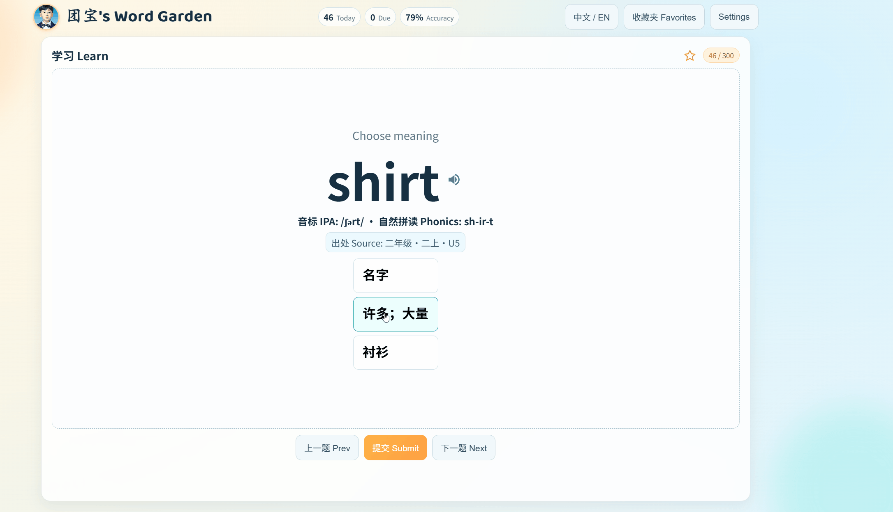

<div align="center">
  
  <h1>Basic Reading Core Words</h1>
  <p><strong>A local-first English vocabulary learning project for children.</strong></p>
  <p>Built for adaptive review, daily practice, and lightweight content operations.</p>
</div>

This repository provides two core workflows:

- Web learning application (Flask + vanilla frontend + SQLite)
- Vocabulary pipeline for generating web wordbanks and printable PDF materials

---

## Demo



## Highlights

- Book-based vocabulary learning
- Daily study target (default: 20 words)
- SM-2 spaced-repetition scheduling (Ebbinghaus-inspired)
- Three quiz modes:
  - Meaning choice (EN -> ZH)
  - Image choice (pick 2 out of 3)
  - Typing completion
- 面向国内用户的中文界面
- Persistent local progress tracking in SQLite

## Repository Layout

```text
.
|- books/                  # Vocabulary books and source files
|- src/scripts/            # PDF build pipeline (vocab_pdf) and CLI utilities
|- src/backend/            # Flask API, scheduler, storage, wordbank logic
|- src/frontend/           # Single-page frontend (HTML/CSS/JS)
|- src/data/study.db       # Runtime SQLite DB (auto-created)
|- requirements.txt        # Python dependencies
|- Makefile                # Root command entrypoint
`- DESIGN.md               # Product/design notes
```

## Requirements

- Python 3.12 recommended
- make recommended (WSL2/Linux/macOS)
- **Windows + Python only in WSL2:** open a WSL shell, `cd` to this repo (prefer a Linux path such as `~/...` under your home—not only `/mnt/c/...`—for much faster I/O), then run the `python` / `make` commands below. From PowerShell you can run one-offs with `wsl -e bash -lc 'cd /path/to/basic-reading-core-words && python -m pip install -r requirements.txt'`.

## Quick Start (Web App)

### 1. Install dependencies

```bash
python -m pip install -r requirements.txt
```

### 2. Build web wordbanks

```bash
python src/backend/build_wordbanks.py
```

Or:

```bash
make web-build-wordbanks
```

### 3. Start the local server

```bash
python src/backend/app.py
```

Or:

```bash
make web-run
```

### 4. Open in browser

```text
http://127.0.0.1:5000
```

## Docker

镜像内用 **Gunicorn** 跑 `src.backend.app:app`（单 worker，减轻 SQLite 并发写压力）。学习数据写在 **`/app/src/data`**，应用 **`docker-compose.yml` 里的命名卷** 或自行 `-v` 挂载以持久化。

### 构建并运行（Compose）

```bash
docker compose build
docker compose up
```

浏览器访问 **http://localhost:8080**（映射到容器内 `5000`）。学习进度保存在 Compose 的 **`study-data`** 卷中。若要把本机已有 `src/data/` 挂进容器，可把 `docker-compose.yml` 里的 `volumes` 改成：

```yaml
    volumes:
      - ./src/data:/app/src/data
```

### 仅 Dockerfile

```bash
docker build -t basic-reading-core-words .
docker run --rm -p 8080:5000 -v study_data:/app/src/data basic-reading-core-words
```

环境变量与本地一致（`APP_HOST`、`APP_PORT`、`STUDY_DB_PATH` 等）。生产环境请自行加 TLS 反向代理（如 Caddy / nginx）。

## Common Commands

```bash
make web-install          # Install runtime dependencies
make web-build-wordbanks  # Build books/*/wordbank.web.json
make web-run              # Start local web service
make web                  # Build wordbanks, then run web app

make test-network         # Test online translation/dictionary connectivity

make BOOK=新交际一二年级和基础阅读        # Build selected book PDF (incremental)
make BOOK=新交际一二年级和基础阅读 rebuild
make BOOK=新交际一二年级和基础阅读 clean
```

## Configuration

### Environment Variables

- APP_HOST (default: 127.0.0.1)
- APP_PORT (default: 5000)
- APP_DEBUG (default: 0)
- STUDY_DB_PATH (default: src/data/study.db) — stores SM-2 progress (gitignored). Refactors must not delete or replace this file; progress is keyed by vocabulary folder name + word id (see DESIGN.md).
- If you **rename** a book folder under `books/`, copy `book_dir_renames.example.json` to `src/data/book_dir_renames.json` (same directory as the DB) with a mapping from the **old** folder name to the **new** one, then restart the app once so SQLite rows migrate.
- DAILY_TARGET_DEFAULT (default: 20)
- IMAGE_MODE_ENABLED (default: 1)
- IMAGE_PROVIDER (default: loremflickr)

### Proxy Setup

If your network requires a proxy, copy proxy.env.example to proxy.env.
The root Makefile automatically loads proxy.env when present.

```bash
cp proxy.env.example proxy.env
```

PowerShell:

```powershell
Copy-Item proxy.env.example proxy.env
```

## Data Model

### Wordbank Input/Output

- Input: source files under books/<book>/, configured by book.json
- Output: books/<book>/wordbank.web.json for web learning

Key fields in wordbank.web.json:

- book metadata
- words[] entries with id, display, translation, pronunciation, sources, tags, and metadata

### Study Storage (SQLite)

Default path: src/data/study.db

Main tables:

- user_settings
- word_state
- review_log

`user_settings` includes `fetch_ipa` (在线音标 / online IPA). The web **Rebuild Wordbank** action uses this value from the Settings panel. Command-line builds (`make`, `build_wordbanks.py`, etc.) still follow each book’s `book.json` `fetch_ipa` unless you pass overrides in code.

## API Overview

- GET /api/health
- GET /api/books
- POST /api/wordbank/rebuild
- GET /api/settings
- POST /api/settings
- GET /api/session
- POST /api/answer
- GET /api/progress
- GET /api/wordbank/overview
- GET /api/book/pdf
- POST /api/reset

`progress` objects (from `/api/progress`, `/api/session`, and `/api/wordbank/overview`) include: `totalWords`, `learnedWords`, `newWords`, `dueWords`, `todayReviewed`, `todayAttempts` (submit rows today), `todayCorrect`, `todayAccuracy`. Overview also returns `dailyTarget` for the daily-target bar. The wordbank overview page appends an estimate **days to clear “未学”** as `ceil(newWords / dailyTarget)` (tooltip explains that due-word reviews are not subtracted from that quota).

`GET /api/book/pdf` builds the selected book PDF in **offline** mode (no translation/IPA network calls) and returns it as a download — same pipeline as `make pdf` in the book directory.

## Add a New Vocabulary Book

1. Copy books/新交际一二年级和基础阅读 to a new subfolder.
2. Add your source files (for example, *.md).
3. Update that folder's book.json.
4. Update VOCAB in that folder's Makefile.
5. Run make in the book folder, or run make BOOK=<folder_name> from repo root.

See books/README.md for detailed book format guidance.

## PDF Build (Optional)

Inside a book directory:

```bash
make
```

Force rebuild:

```bash
make rebuild
```

If online translation/IPA is enabled, test connectivity first:

```bash
make test-network
```

Offline fallback:

- Maintain books/<book>/translations.json
- Keep translate_missing=false in book.json

## Troubleshooting

### UI appears stale or blank

The backend sets no-cache headers for static assets. If needed, hard-refresh the browser and restart the server.

### Image mode fails to load

The frontend includes fallback image behavior. In restricted networks, disable image mode and use meaning/typing modes.

### Need to reset learning progress

Use the Reset action in the app, or remove the SQLite file and restart.

## Development Notes

- Build wordbanks before starting the web app.
- **Cursor Agent auto-commit**: see [.cursor/README-hooks.md](.cursor/README-hooks.md) (runs on agent `stop`, not on every manual keystroke).
- Quiz logic: src/backend/quiz.py
- Scheduling logic: src/backend/scheduler.py
- Frontend interaction: src/frontend/app.js
- Product/design context: DESIGN.md
